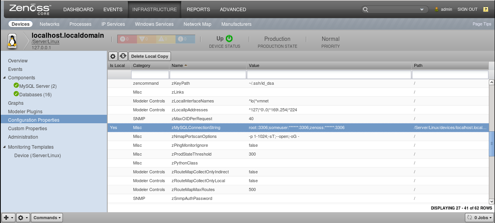
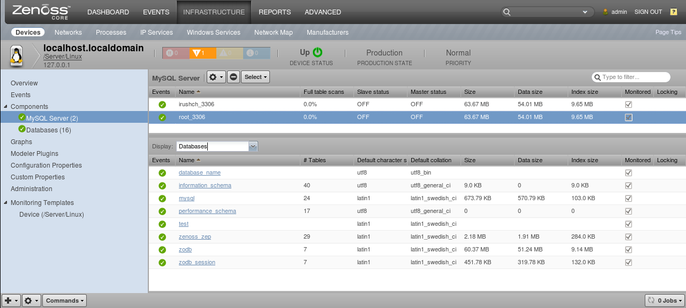
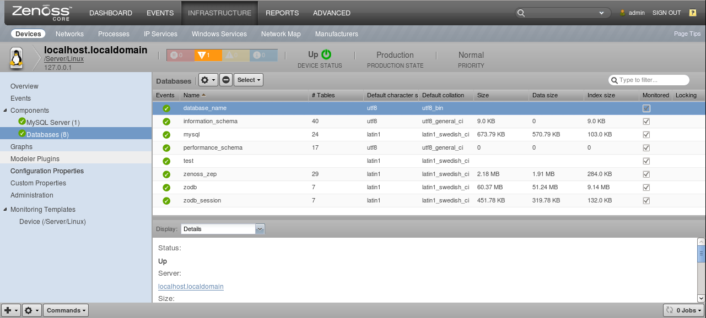
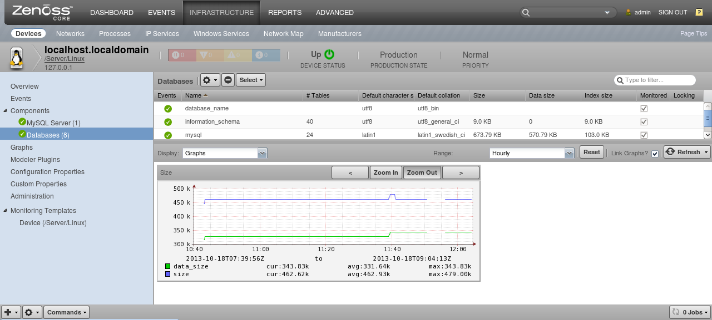
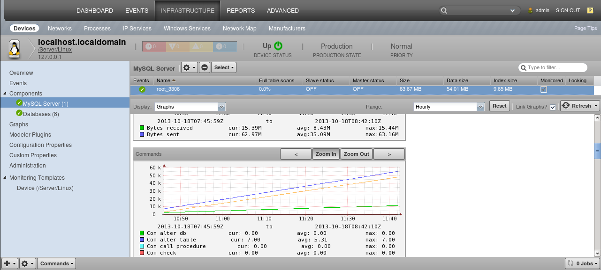
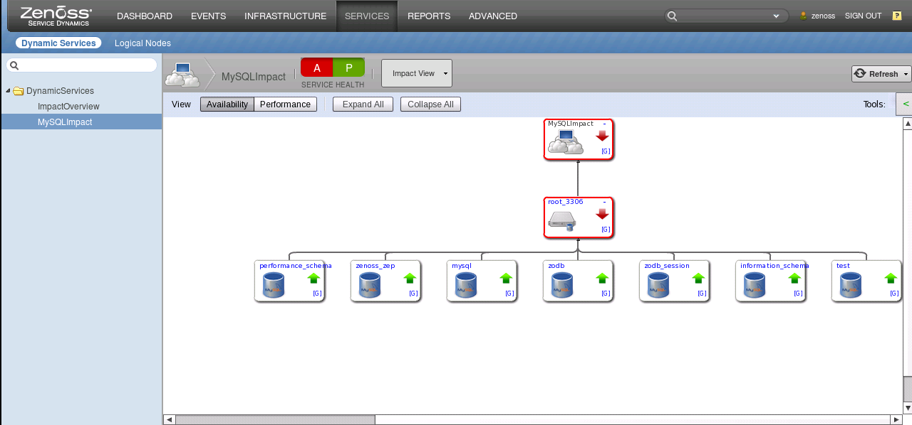

Background
------------

This ZenPack provides monitoring for MySQL 5.5 and later. Monitoring for the
following MySQL entities is provided using `twisted.enterprise.adbapi`
asynchronous framework. See the Usage section for details.

Please restart zenoss after installing this ZenPack. Note that the commercial
zenoss version requires *ZenPacks.zenoss.Impact*, otherwise the
*DynamicServices* panel will be missing.

Gallery
-------

Features
--------

The features added by this ZenPack can be summarized as follows.
They are each detailed further below.

-   Discovery of MySQL entities.
-   Monitoring of MySQL Server and Database components.
-   Event management and monitoring for certain MySQL states.
-   Optional service impact with addition of Zenoss Service Dynamics product.

### Discovery

The following entities will be discovered through *zMySQLConnectionString*
property you provide. The attributes, tags and collections will be updated on
Zenoss' normal remodeling interval which defaults to every 12 hours.

Servers:

*  *Attributes*: Percentage of full table scans, Slave status, Master status, Number of databases
*  *Tags*: Name
*  *Collections*: Databases

Databases:

*    Attributes: Number of tables, Default character set, Default collation
*    Tags: Name

Note that all the discovered values for the attributes above are shown as of
the last modeling time.

### Monitoring

The following metrics will be collected every 5 minutes by default. The
*Average* statistic is collected, and the graphed value is per second for
anything that resembles a rate.

Server:

* Metrics:

    |                      |                        |                         |                          |
    | -------------------- | ---------------------- | ----------------------- | ------------------------ |
    | * Size               | * Data size            | * Index size            | * Connections            |
    | * Threads connected  | * Max used connections | * Uptime                | * Aborted clients        |
    | * Aborted connects   | * Bytes received       | * Bytes sent            | * Com create db          |
    | * Com drop db        | * Com alter db         | * Com create table      | * Com alter table        |
    | * Com drop table     | * Com create user      | * Com drop user         | * Com call procedure     |
    | * Com commit         | * Com check            | * Com delete            | * Com delete multi       |
    | * Com execute sql    | * Com flush            | * Com insert            | * Com insert select      |
    | * Com purge          | * Com repair           | * Com replace           | * Com rollback           |
    | * Com select         | * Com update           | * Com update multi      | * Handler commit         |
    | * Handler delete     | * Handler rollback     | * Handler update        | * Handler write          |
    | * Handler read first | * Handler read key     | * Handler read last     | * Handler read next      |
    | * Handler read prev  | * Handler read rnd     | * Handler read rnd next | * Handler savepoint      |
    | * Key reads          | * Key writes           | * Key read requests     | * Open files             |
    | * Open streams       | * Open tables          | * Select full join      | * Select full range join |
    | * Select range       | * Select range check   | * Select scan           | * nothing                |

Databases

* Metrics:

  - Size
  - Data size
  - Index size|

### Event monitoring

According to the following MySQL states this ZenPack will trigger events with
an appropriate summary message.

Device

:    Critical event:

     * Invalid *zMySQLConnectionString* property,
     * Access denied for user with credentials provided in *zMySQLConnectionString* property.

Service

:    Error event:

     * Slave error,
     * MySQL server is not accessible.

:    Info event:

     * A database was dropped.

Database

:    Warning event:

     * A table was dropped.

:    Info event:

     * A table was added.
     * InnoDB Deadlock occurred.

### Service Impact

When combined with the Zenoss Service Dynamics product, this ZenPack adds
built-in service impact capability for MySQL. The following service impact
relationships are automatically added. These will be included in any services
that contain one or more of the explicitly mentioned entities.

Service Impact Relationships

-   Device failure impacts the Server component.
-   MySQL Server component impacts Database components.

Usage
-----

To start monitoring your MySQL server you will need to setup connection to it
as well as bind monitoring templates and modeler plugin to the device or device
class containing your MySQL servers.

Use the following steps to start monitoring MySQL using the Zenoss web interface.

1.  Navigate to the *Configuration Properties* page of the device containing
    your MySQL servers
    (see [1](http://wiki.zenoss.org/File:Configuration_properties_panel.png)).
2.  Set user name, password and port in the appropriate fields of
    *zMySQLConnectionString* property (see
    [2](http://wiki.zenoss.org/File:Edit_zMySQLConnectionString_property.png)).
    For non-root users please make sure to grant all privileges to avoid access
    denied errors. Note that user name is required.
3.  Navigate to the *Modeler plugins* page of the device containing your MySQL
    servers, add the *MySQLCollector* modeler plugin and remodel the device.
    This will automatically find the MySQL servers and databases and begin
    monitoring them immediately for the previously mentioned metrics.

As the custom widget for MySQL credentials is not compatible with Zenoss 4.1,
the *zMySQLConnectionString* property in this version should be set as a valid
JSON list (e.g. ''[{"user": "root", "passwd": "", "port": "3306"}] '')

Monitoring busy MySQL servers affects *zenpython* daemon. You may change
*zMySqlTimeout* property to specify how long it should wait for response from
MySQL server.

Legacy method

The latest version of ZenPack uses *zenpython* daemon for monitoring and
automatically binds monitoring templates to MySQL components. However, if you
are inclined to use the legacy method for MySQL monitoring (v2.2.0), you
should:

1.  Bind the device-level monitoring template *MySQL /Server* to the target device.
2.  Set *zMySqlUsername*, *zMySqlPassword* and *zMySqlPort* configuration
    properties (if the credentials are not valid or not set, you will receive
    the event with in 'App/MySQL' event class).
3.  Make sure that *zencommand* daemon is running.

Prerequisites
-------------

If you are using the commercial zenoss version and *zends*, please make sure to
create a symbolic link by executing the following command:

>>> ln -s /var/lib/zends/zends.sock /tmp/mysql.sock

Troubleshooting
---------------

If you encounter any issues with Zenpack installation, please make sure that
you have restarted zenoss after installation and your target disk has enough
free memory and read permissions enabled.

In case of any issues when uninstalling this Zenpack, please remove all
components first. Note that device monitoring requires *zenpython* daemon to be
constantly running.

If you have just enabled monitoring, try pressing *Zoom in* to see the graphs.
In case of any issues you can run zenpython daemon in foreground with
`zenpython run -v10 -c` command and check if there are no exceptions.
If zenpython runs without errors and prints monitoring data to stdout, then you
should check if monitoring templates are bound to the components.

In case device modeling fails:

-   make sure, that you have specified a correct user, password and port to your MySQL user account;
-   grant privileges
    (see [MySQL GRANT Syntax](http://dev.mysql.com/doc/refman/5.1/en/grant.html))
    to non-root users to avoid access denied errors by executing the following command.
    REPLICATION CLIENT privilege is needed to retrieve MySQL Replication data.

>>> GRANT SELECT, REPLICATION CLIENT ON \*.\* TO 'username'@'%' WITH GRANT OPTION;

Change '%' to 'localhost' in the statement above if you are modeling the local MySQL server.

-   check if firewall allows connections on mysql port;
-   ensure that you are able to connect from zenoss server to target MySQL
    server instance by executing the following from the command line:

>>> mysql -h<host> -u<username> -p<password> -P<port>

Note that the query ` select host from mysql.user` should have an entry '%' for
'host' field to ensure the remote connection.

Please note that "MySqlDeadlockPlugin" used to detect deadlocks in MySQL requires PROCESS / SUPER priviledges (depending on MySQL version. Pugin use SQL query like: "SHOW ENGINE INNODB STATUS" to retrieve this information). So for security reasons this plugin may be disabled.

Migration
---------

When migrating from MySqlMonitor ZenPack v2.2.0, you should:

-   Install the new version of the ZP;
-   Restart Zenoss Services;
-   Make sure to leave the old version in place during the install process.
    The new *zMySQLConnectionString* property will be constructed using MySQL
    credentials from older ZenPack version;
-   Bind the modeler plugin as described in the *Usage* section;
-   Model the device components;
-   Remove the old monitoring template (*MySQL /Server*) from the device.

Due to different mechanisms of MySQL monitoring, it is not possible to migrate
the old RRD data from the previous version of ZenPack. The Graph data will
remain and will be updated until the user manually removes the *MySQL /Server*
monitoring template.

Installed Items
---------------

Installing this ZenPack will add the following items to your Zenoss system.

Modeler Plugins

-   MySQLCollector

Monitoring Templates

-   MySQLServer(in /Server)
-   MySQLDatabase (in /Server)
-   MySQL (in /Server) (obsolete)

Component Types

-   MySQLServer (on related device)
-   MySQLDatabase (on MySQLServer)

Changes
-------

3.1.0 (2017-12-29)

-   Fixed error messages to be more informative. (ZPS-2684)
-   Fix missing clear events. (ZPS-2432)
-   Fix unit tests.

3.0.9 (2017-04-04)

-   Update events and event class mappings to facilitate transforms. (ZPS-500)

3.0.8 (2017-01-16)

-   Give datasource events unique eventKeys to avoid false-clearing. (ZPS-500)
-   Set default timeouts for data collection DB connection. (ZPS-313)

3.0.7 (2015-11-25)

-   Fix datasources to not block zenpython. (ZEN-19220)

3.0.6 (2015-06-18)

-   Added zMySQLTimeout property and timeout for datasource plugins.

3.0.5 (2015-02-05)

-   Restore functionality of deprecated MySqlMonitor datasource. (ZEN-16452)

3.0.4 (2014-12-18)

-   Add support for Zenoss 5x.
-   Move InnoDB Deadlock event to database component, and clear it in 30min.

3.0.3 (2014-11-05)

-   Fix graphpoint sequences to fix graphpoint colors.
-   Close connections pools when done to avoid leaking threads.

